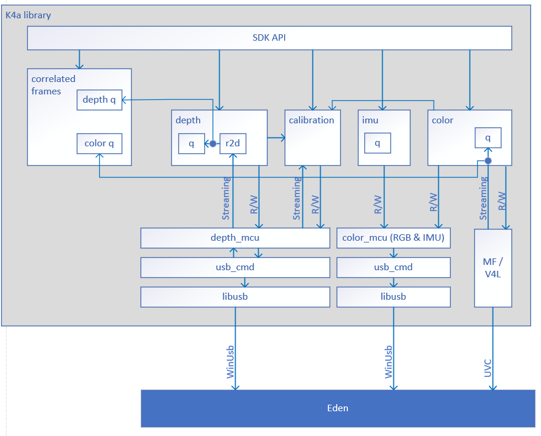

# Kinect for Azure SDK

# Architecture

Project Kinect for Azure is a sensor that contains a depth camera, color camera, an imu, and audio mic array. The SDK 
provides interfaces to the depth, color, and IMU sensors. Audio and parts of the color sensor will be routed through 
system primitive interfaces so that they may be used without the need for the SDK to be running.

The SDK is broken into a modular design that allows individual components to be tested in isolation before being 
integrated into the system.

# Construction of the K4A SDK
The user will open and initialize the k4a SDK by calling k4a_device_open. The library will create:
1. depth_mcu
1. color_mcu

These two modules will create USB command (CMD) modules that are responsible for interfaceing with LIBUSB and 
communincating with the hardware.

Next the library will create the calibration module, where calibration data will be stored and extrinsic data can be 
convereted to offsets between sensors (as 1 example).

Once the calibration module has been created, the k4a library will create the following modules:
1. depth
1. color
1. imu

When creating these modules, they will recieve a handle to calibration, depth_mcu, and color_mcu so that the they can 
communicate with the necessary modules.

Finally the K4A library will create the SDK API module and pass it calibration, color, depth, and imu handles to support
the public interfaces.

The creation of the 'correlated captures' module is on demand when correlated data is needed. 

# Data flow and threads

The SDK is designed such that the caller owns most of the threads responsible for accessing the sensor. API calls to 
configure, start, stop, and fetch capture data are all designed for the the user to call into the SDK and block if neccessary.

The 'usb_cmd' modules are an exception to this as they require a dedicate thread to keep LibUsb filled with buffers so 
that we can stream depth and imu data to the SDK. (The color sensor will also likely have a thread. That part of the 
design is still TBD.) The 'usb_cmd' thread will call a callback function to depth or imu. In the case of the depth 
callback function for streamed date, the data will be briefly sent to the 'r2d' (raw to depth) module so the raw 
depth capture can be converted to depth point map. Once the 'r2d' is done with the convertion the sample will be given to
the queue. If the user has called an API like k4a_device_get_capture on an empty queue, then the users thread will be 
unblocked and allowed to return the newly provided capture.

If the user has configured the SDK for correlated captures, then the depth and color callback functions will also provide 
the respective samples to the 'correlated captures' module.

