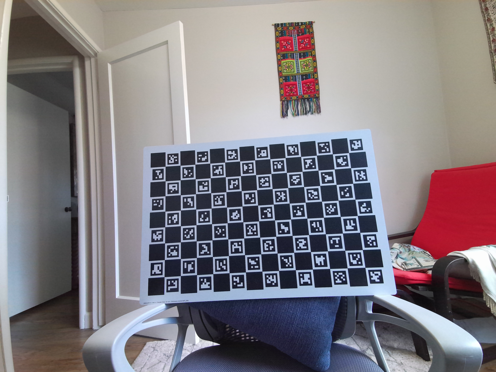

# Camera Calibration and Registration ReadMe

Here we supply examples for the user to run camera calibration on a single camera, and registration
to identify spatial relationships between different cameras.

## Installation

1. Installation Process
    * Install python 3.7 or greater, include pip.
    * Install pipenv to make use of the Pipfile provided in the repo.
    * Change directory to this directory.
    * Run the command pipenv shell.
    * Run the command pipenv install.
2. Software dependencies.
   * None. No external software is needed to run these tools beyond the python packages listed in the
                Pipfile. The only expectation is that images have already been collected externally, and, for the
                purposes of registration, that two images are looking at the same target.
3. Latest releases
   * 1.0.0
4. API references
   * None

## Running Camera Calibration and Registration

These scripts enable developers to do two things: Calibrate a given camera, and register two given cameras to each other. These examples are agnostic to the type of camera and therefore may be used for any set of cameras.

1. Setup: Capture images.
   1. To run calibration and registration, you need enough images of a target board from enough angles for the model to converge. (typically min 30 images per camera).
   2. Print out the target provided in the repo: `example_files\plane.pdf`. We actually provide 3 sizes as pdfs and jsons.
   `plane_small.pdf` is designed to be printable on a standard 8.5x11 sheet of paper, and `plane_large.pdf` is double
   the size of the plane file used in the example data.
   3. The `plane.json` provides the code the physical parameters of the board. Square length is the length of one side in mm of the charuco_square, marker_length is the size length of the QR code marker in mm. Change these based on the side length of the board printed.
        * Parameter aruco_dict_name is an ENUM specifying the tag type. The one used in the above example is #6
        * See predefined dictionaries at [OpenCV](https://docs.opencv.org/master/dc/df7/dictionary_8hpp.html)
         
   4. To capture good data, it is recommended to take images of the target board with both cameras at distances close in, far away, and from multiple pointing angles. Around 30 images per camera is sufficient. See the provided example data for reference.
   5. In all images, if you can visually see fiducial features on the board, and the image is not grainy, it will be of calibration worthy quality.
       * A good way to capture images is using the Azure Kinect DK recorder. Example command: `k4arecorder.exe -c 3072p -d PASSIVE_IR -l 5  board1.mkv`
       * Good example: The fiducial lines are clear and distinct even to the human eye.
       * You may need to normalize IR images to make them visible.
        
   6. For registration, this means taking images from both cameras with a board that is not moved between captures. Unlike calibration, this requires only one capture per camera.

2. How to calibrate a camera.
   1. Calibration typically requires about 30 images and relies on the Brown Conrady distortion model.
   2. The script `calibrate.py` is designed to take in command line arguments so it can be used personally collected data without modification. For further details please see [Camera Calibration](https://docs.opencv.org/master/dc/dbb/tutorial_py_calibration.html) in the OpenCV documentation.
   3. If you already have a collected set of data, run the calibration code this way:

      ``` windows
      python <full_path>\calibrate.py --dataset-dir <dataset_dir> --template <full_path_template>
      ```

      The tool may optionally take in an existing calibration file with the flag `--calib-file`

   4. If the calibration is successful, this will generate a `calib.yml` file in the dataset-dir directory.

3. How to register a camera.
The script `register.py`, like `calibrate.py` is designed to take in command line arguments so it can be used as an example without modification. It is designed to allow the user to get the extrinsic rotation and translation from camera B to camera A.
   1. This requires that both cameras have been successfully calibrated prior to this tool.
   2. Find the five files you will need. Two images (one per camera) taken at the same time and the corresponding `calib.yml` calibration files generated for a well calibrated camera. Also pass in the template file.
        * Example: RGB and IR images taken simultaneously.
        * 
        * 
   3. If you already have a collected set of data, run the calibration code this way:

        ``` windows
        python <full_path>\register.py --img-a <full_path_img_a> --img-b <full_path_img_b> `
        --template <full_path_template> --calib-a <full_path_calibration_a> `
        --calib-b <full_path_calibration_b> --out-dir <out_dir>
        ```

   4. If successful, the code will print out the rotation and translation matrix from camera B to camera A and save the calibration blob as a json.
