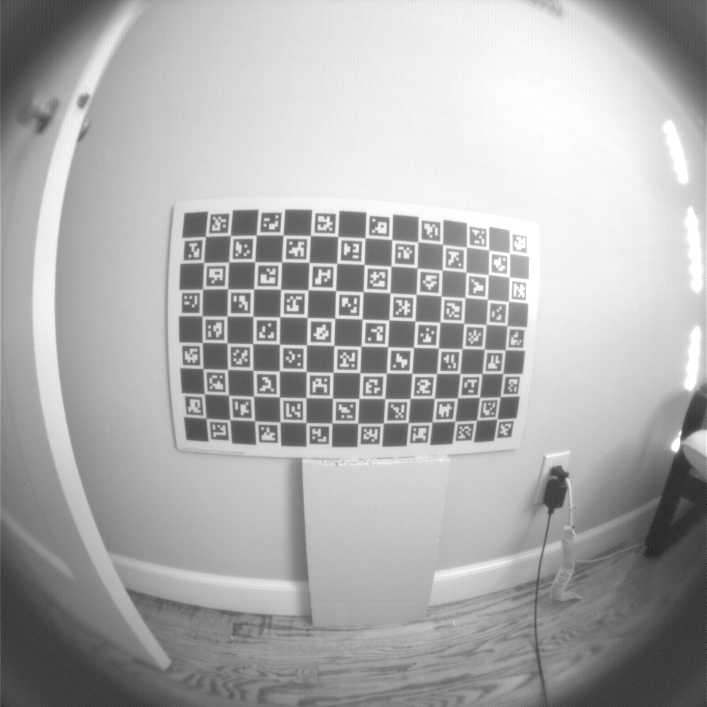
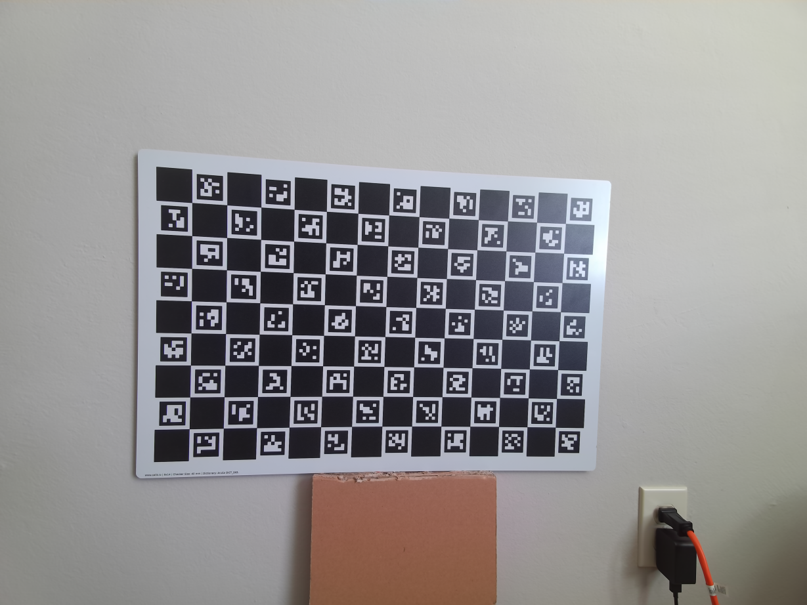

# Azure Kinect - Depth Evaluation Tools Examples

## Description

   Depth Evaluation Example Tools for Azure Kinect DK.

   These tools enable developers to collect depth and color images from a Azure Kinect device (`collect`), convert mkv files to images (`mkv2images`), evaluate the depth bias (`depth_eval`), and evaluate the transformation re-projection error between sensors (`transformation_eval`).

---
## Setup

   * Print out one of the three target files targets provided in the repo: `plane_files\plane.pdf`, `plane_files\plane_large.pdf` or `plane_files\plane_small.pdf`.

      * The small plane file is sized to fit on an 8.5"x11" piece of paper. The large plane file is twice the size of `plane.pdf`.

   * `plane.json`, `plane_large.json` and `plane_small.json` define the physical parameters of the target board. Square length is the length of one side in mm of the charuco_square, marker_length is the size length of the QR code marker in mm. You can use opencv to create your own Charuco target. In this case you would need to copy and modify the json parameters accordingly.

		* Parameter aruco_dict_name is an ENUM specifying the tag type. All plane files use dictionary number six.

		* See predefined dictionaries on the OpenCV website [here.](https://docs.opencv.org/master/dc/df7/dictionary_8hpp.html)
         

   * To capture good data, it is recommended to capture images of the target board with the camera(s) aligned with the center of the target and from a reasonable distance such that the target board fills the majority of the view. The target should be as flat as possible. It is also best to avoid being low to the floor and to minimize reflections in the space. See the provided example data for reference.

   * For high quality data, the image should _not_ be grainy and you should be able to visually see all fiducial features on the board.

	   * The majority of the tools take a MKV file as an input. A good way to capture data is to use the Azure Kinect DK recorder. Example command: ```k4arecorder.exe -c 3072p -d PASSIVE_IR -l 5  board1.mkv```

	   * Good example: The fiducial lines are clear and distinct even to the human eye.

	   * To verify the collected data is of high quality, use the `mkv2images` tool to view the data collected.

        

		

---
## Using the `collect` Tool to Capture Images

   * This tool is used to collect color, passive IR, and/or depth images from the device.

   * Based on the number of view specified (-nv), this tool will pause after each capture to allow the user to move the device to the next position.

   * This tool is a good aid for collecting images for use with the Calibration and Registration tools. 

   * Minimum example command: ```./collect  -mode=3 -res=1 -nv=2 -nc=10 -cal=1 -out=c:/data```

   * The following are all the options exposed by this tool, see tool specific [README](collect/README.md) for more information:

   ```
   ./collect -h or -help or -? print the help message
   ./collect -mode=<depth mode> -res=<color resolution> -nv=<num of views> -nc=<num of captures per view> 
   -fps=<frame rate enum> -cal=<dump cal file> -xy=<dump xytable> -d=<capture depth> -i=<capture ir> -c=<capture color>
   -out=<output directory>
   -gg=<gray_gamma used to convert ir data to 8bit gray image. default=0.5>
   -gm=<gray_max used to convert ir data to 8bit gray image. default=4000.0>
   -gp=<percentile used to convert ir data to 8bit gray image. default=99.0>
   -av=<0:dump mean images only, 1:dump all images, 2:dump all images and their mean>
   ```

---
## Using the `mkv2images` Tool to Convert MKV captures to Images

   * This tool is used to dump png images from a provided MKV file.

   * This tool should be used to verify that the collected mkv data is of high enough quality as mentioned in the setup section.

   * It is recommended that MKV files are collected using the Azure Kinect DK recorder.

	  * Example command: ```k4arecorder.exe -c 3072p -d PASSIVE_IR -l 5  board1.mkv```

   * Minimum example command: ```./mkv2images -in=board1.mkv -out=c:/data -c=0 -f=0```

   * The following are all the options exposed by this tool, see tool specific [README](mkv2images/README.md) for more information:

   ```
   ./mkv2images -h or -help or -? print the help message
   ./mkv2images -in=<input mkv file> -out=<output directory> -d=<dump depth> -i=<dump ir> -c=<dump color>
   -f=<0:dump mean images only, 1 : dump first frame>
   -gg=<gray_gamma used to convert ir data to 8bit gray image. default=0.5>
   -gm=<gray_max used to convert ir data to 8bit gray image. default=4000.0>
   -gp=<percentile used to convert ir data to 8bit gray image. default=99.0>
   ```

---
## Using the `depth_eval` Tool to Evaluate Depth Bias

   * This tool is used to evaluate the depth bias of a device. 

   * This tool requires two MKV files as input, one captured using PASSIVE_IR and the other using WFOV_2X2BINNED. These two files should be collected with the camera and target board setup unchanged.

   * The Passive IR MKV file should be collected using the following command: ```k4arecorder.exe -c 3072p -d PASSIVE_IR -l 3  board1.mkv```

   * The Depth MKV file should be collected using the following command: ```k4arecorder.exe -c 3072p -d WFOV_2X2BINNED -l 3 board2.mkv```

   * This tool will evaluate the depth bias of the device and output the results to the console.

   * The output consists of four values. Total charuco corners as specified by the charuco dictionary, the actual number of detected corners (Depends on image quality, the higher the better), the Mean Z depth bias in millimeters, and the RMS Z depth bias in millimeters. 

   * Depth bias is the difference between the ground truth depth measurement (determined by the projection of the target board) and the measured depth from the sensor. 

   * Example Output:

   ```
   board has 104 charuco corners
   number of detected corners in ir = 101
   Mean of Z depth bias = 3.33104 mm
   RMS of Z depth bias = 3.47157 mm
   ```

   * The maximum bias should be expected to be within +/- 11mm. A depth bias outside of this range indicates a poor device calibration and the example Calibration tool should be used to obtain an improved calibration that can be stored (external of the device) and used in place of the factory calibration (Note: The factory calibration stored on the Kinect device can not be overwritten). 

   * Minimum example command: ```./depth_eval -i=board1.mkv -d=board2.mkv -t=plane.json -out=c:/data```

   * The following are all the options exposed by this tool, see tool specific [README](depth_eval/README.md) for more information:

   ```
   ./depth_eval -h or -help or -? print the help message
   ./depth_eval -i=<passive_ir mkv file> -d=<depth mkv file> -t=<board json template>
   -out=<output directory> -s=<1:generate and save result images>
   -gg=<gray_gamma used to convert ir data to 8bit gray image. default=0.5>
   -gm=<gray_max used to convert ir data to 8bit gray image. default=4000.0>
   -gp=<percentile used to convert ir data to 8bit gray image. default=99.0>
   ```

---
## Using the `transformation_eval` Tool to Evaluate Transformation Mapping Between Sensors

   * This tool is used to evaluate the transformation between the sensors of a single device.

   * This tool requires two MKV files as input, one captured using PASSIVE_IR and the other using WFOV_2X2BINNED. These two files should be collected with the camera and target board setup unchanged.

   * The Passive IR MKV file should be collected using the following command: ```k4arecorder.exe -c 3072p -d PASSIVE_IR -l 3  board1.mkv```

   * The Depth MKV file should be collected using the following command: ```k4arecorder.exe -c 3072p -d WFOV_2X2BINNED -l 3 board2.mkv```

   * This tool will evaluate the transformation re-projection error between the color camera and depth sensor of a device.

   * The output consists of five values. Total charuco corners as specified by the charuco dictionary, the actual number of detected corners in IR capture (_Depends on image quality, the higher the better_), the actual number of detected corners in the color capture (_Depends on image quality, the higher the better_), the number of common corners detected between the images, and the RMS re-projection error in pixels.

   * Use the `-s` flag to generate and save visual representations of the transformation re-projection error.
      
	  * The output image, `checkered_pattern.png`, is a visual representation of the sensor registration error. The image is a composition of the color and IR images. Zooming in, the registration error (alignment of Charuco target pattern) can be clearly seen at the boundaries of the checkerboard pattern.

	  * The output image, `transformation_error.png`, is a visual of the re-projection error represented as a vector field. Zooming in, the green mark is the location of the detected marker corner in the color image, and the blue marker represents the projected position of the detected marker corner in the IR image.

   * Re-projection error is the difference between the position of the target in the color image and the target as captured in the IR image projected into the coordinate space of the color camera.

   

   * Example Output:

   ```
   board has 104 charuco corners
   corners detected in ir = 73
   corners detected in color = 93
   number of common corners = 65
   rms = 7.42723 pixels
   ```

   * The RMS re-projection error should be no greater than 12 pixels. An RMS re-projection error greater than this indicates a poor device registration and the example Registration tool should be used to correct the device registration.

   * Minimum example command: ```./transformation_eval -i=board1.mkv -d=board2.mkv -t=plane.json -out=c:/data```

   * The following are all the options exposed by this tool, see tool specific [README](transformation_eval/README.md) for more information:

   ```
   ./transformation_eval -h or -help or -? print the help message
   ./transformation_eval -i=<passive_ir mkv file> -d=<depth mkv file> -t=<board json template>
   -out=<output directory> -s=<1:generate and save result images>
   -gg=<gray_gamma used to convert ir data to 8bit gray image. default=0.5>
   -gm=<gray_max used to convert ir data to 8bit gray image. default=4000.0>
   -gp=<percentile used to convert ir data to 8bit gray image. default=99.0>
   ```
---
## OpenCV Dependency 

   These example tools require both OpenCV and OpenCV Contrib to be installed prior to building the SDK. After installing OpenCV Contrib, the lib path in ```cmake/FindOpenCV.cmake``` will need to change from ```C:/opencv/build/x64/vc14/lib``` to ```C:/opencv/build/x64/vc16/lib```

   If a prior version of OpenCV exists in ```C:\opencv```, remove it before running the following steps. 

   To build opencv and opencv_contrib from source follow these steps:

   [General Instalation Toutorial](https://docs.opencv.org/4.5.0/d0/d3d/tutorial_general_install.html)

   [OpenCV configuration options](https://docs.opencv.org/master/db/d05/tutorial_config_reference.html)

   1. Start an instance of "x64 Native Tools Command Prompt for VS 2019" 

   2. Clone opencv and opencv_contrib:

      ```c:\> git clone https://github.com/opencv/opencv && git -C opencv checkout 4.5.0```

      ```c:\> git clone https://github.com/opencv/opencv_contrib && git -C opencv_contrib checkout 4.5.0```

   3. Build Release Version

      ```c:\> cd opencv && mkdir build && cd build```

      ```c:\opencv\build> cmake .. -GNinja -DOPENCV_EXTRA_MODULES_PATH=../../opencv_contrib/modules -DBUILD_opencv_world=ON -DCMAKE_BUILD_TYPE=Release -DBUILD_PERF_TESTS:BOOL=OFF -DBUILD_TESTS:BOOL=OFF -DCMAKE_INSTALL_PREFIX=c:/opencv/build```

   4. Install Release Version

      ```c:\opencv\build> cd ..```
      
      ```c:\opencv> cmake --build c:/opencv/build --target install```

   5. Build Debug Version

      ```c:>mkdir build_debug && cd build_debug```

      ```c:\opencv\build_debug>cmake .. -GNinja -DOPENCV_EXTRA_MODULES_PATH=../../opencv_contrib/modules -DBUILD_opencv_world=ON -DCMAKE_BUILD_TYPE=Debug -DBUILD_PERF_TESTS:BOOL=OFF -DBUILD_TESTS:BOOL=OFF -DCMAKE_INSTALL_PREFIX=c:/opencv/build```

   6. Install Debug Version

      ```c:\opencv\build_debug> cd ..```

      ```c:\opencv> cmake --build c:/opencv/build_debug --target install```


   ***NOTE*** 

   * The default install location for opencv is `c:\opencv\build\install\...`
   * However the Azure-Kinect-Sensor-SDK expects an install at `c:\opencv\build\...`
   * To change the default install location add `-DCMAKE_INSTALL_PREFIX=<path_of_the_new_location>`
   to the `cmake .. -GNinja` command  
