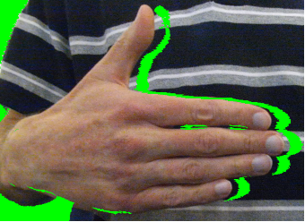
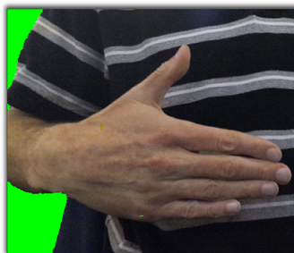
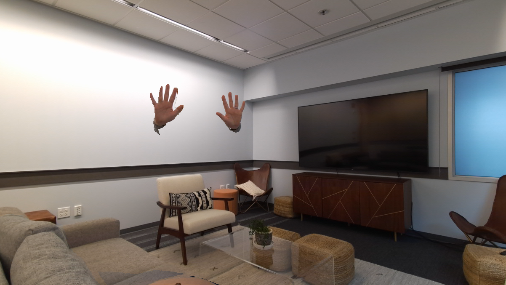

# Green Screen Example

The goal of the green screen example is to demonstrate best practices for using multiple Azure Kinect DK devices, with an
emphasis on synchronization and calibration (the 'green screen' code is only a small portion of the logic). In
particular, the green screen application showcases a physical limitation of the hardware and how it can be mostly
addressed using another device.

## What does this application *do*

The green screen example displays the scene as observed by one of the cameras (the 'main' camera). Using the camera's depth, it will paint over anything beyond its depth threshold with a still image of the background (as seen when the app was started), allowing people and things to "appear" suddenly when they walk within the depth threshold specified by the
user. It will fill in missing details with the 'backup' camera, if possible, resulting in a better green screen than the main camera could achieve alone.

## Why would more than 1 camera be used

First of all, you can use one camera if you like. The first option to the `green_screen` command is the number of devices you'd like to use (1 or 2).

It's true that one camera can get you most of the way to a good solution in this case. However, if you only use one camera (either by using the single-camera mode, or just covering the backup camera), and something in the scene is closer to the camera than something else in the scene (for example, if you hold out an arm), you should see a "shadow" of on the further-away object near the edge of the obstructing object.

   

Why? The answer comes back to the physical construction of the Azure Kinect. The color camera and the depth camera are
physically offset. Therefore, it's possible for the color camera to be able to see something that the depth camera
cannot. If the depth camera cannot see a section of the image that the color camera can, when the depth image is
transformed into the color camera space, segments of the transformed image that correspond to occluded images. These
'invalid' pixels are set to 0. However, using another camera's perspective, some of those missing values can be filled
in using the secondary depth camera, which can (hopefully) see those parts of an object that are occluded from the main
depth camera.

   

## Installation instructions

This example requires OpenCV to be installed to build. To ensure it will be built, ensure that OpenCV is found by adding
`-DOpenCV_REQUIRED=TRUE` to the `cmake` command (this should not be necessary if you have OpenCV installed). If OpenCV 
is installed as recommended then it will automatically be used by the build.

### OpenCV Installation Instructions

#### Linux

`sudo apt install libopencv-dev`

#### Windows

Our recommended way of getting OpenCV on Windows is by installing pre-built libraries. There's even a PowerShell script that'll do much of the work for you in `scripts/install-opencv.ps1`. This will place OpenCV in your `C:\` folder. CMake will copy the OpenCV binaries to the the `${CMAKE_RUNTIME_OUTPUT_DIRECTORY}` folder so that all built binaries will run as expected. A user may choose to add the OpenCV binaries location to thier `%PATH%` to avoid this dependency.

## A Note on Calibration (only relevant for 2-camera version)

This program relies on transforming the backup camera's depth image into the color camera's space. This transformation requires knowing the transformation between the two cameras. To find that transformation, we must calibrate the cameras.
This program relies on OpenCV's chessboard calibration functions. As a result, you should have a chessboard pattern to use while calibrating the cameras. If you don't have one, print one out. You can find a 9x6 one
[here](https://docs.opencv.org/2.4/_downloads/pattern.png) (note that the 9x6 comes from the interior corners, not the number of squares). The example requires the calibration board to be in view for both devices' color cameras for many frames, so make sure it's visible to both cameras.

Checked into this folder is chessboard.png. It is 10 x 7. To OpenCV it is 9 x 6 and 22 mm if printed in landscape, at 100%, and with normal margins. on diferent platforms the printing experience can be different. When printing from the Mac, choose "print entire image" option.

Also, DO NOT move the cameras during or after calibration! Changing that translation will cause the backup camera to provide inaccurate information.

## Running the program

Run the `green_screen` executable in the `bin` folder with no arguments for usage details and defaults, and then fill in any customizations you might need.

The first option is the number of cameras you need. The next three options are for the calibration (if you use our recommended board, you want those to be 9, 6, and (length of an individual calibration square side, in millimeters). If you're only using a single camera, those numbers don't matter, although for validation they should be nonzero. 1 1 1 should be fine.

The rest of the options aren't required. Run the example with no argument for details. In particular, you can change the cutoff threshold distance.

## The Green Screen

Once calibration has completed, a new screen should pop up with a steady video stream. If it's working right, the example will take a picture of what it saw when it first started and display it as a background. Anything within the threshold distance will be shown as it moves in real time, but anything too far away will be replaced with the background.

  

## Potential reasons for failure

- If you're having weird runtime errors, sometimes disconnecting and reconnecting the cameras can help.

- If you can build successfully but there's no executable for this example or the OpenCV compatibility example, you
  probably don't have OpenCV installed, or CMake can't find OpenCV. To force CMake to find OpenCV (failing if it can't),
  pass `-DOpenCV_REQUIRED=ON` as a parameter when you run `cmake`.

- The range of the depth camera is limited by the range of the depth camera, which depends on the depth mode. You may
  need to change the depth mode depending on how far you need to have your cutoff. See
  [here](https://docs.microsoft.com/en-us/azure/Kinect-dk/hardware-specification) for the specs.

- If you're on Linux and you're getting strange libusb or libuvc errors when you try to use more than one camera, see
  [here](https://github.com/microsoft/Azure-Kinect-Sensor-SDK/issues/485).

- If you're on Windows and you're getting a popup about not being able to find an OpenCV dll, you may need to re-check your PATH to make sure it has the directory with that dll in it.
